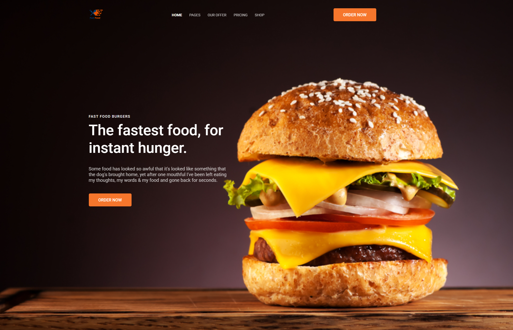
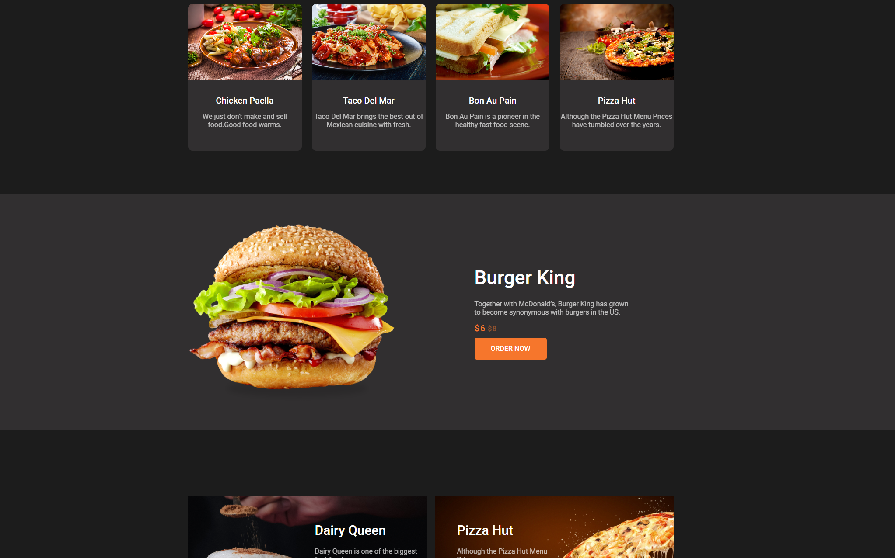

# 🍔 Burger Landing Page

A responsive landing page for a fast food restaurant built with HTML and CSS.

## ✨ Features

- Responsive design
- Semantic HTML5
- CSS3
- Flexbox layout

## 🛠️ Technologies

- HTML5
- CSS3
- Flexbox
- Media Queries

## 🚀 Getting Started

1. Clone the repository:
2. Open `index.html` in your browser.
the website layout is not adapted to different screen sizes, and the container width is 1140px

## 📁 Project Structure

```
/
├── images/
├── index.html
├── style.css
```
## 📸 Preview




## 📄 License

This project is created for educational and portfolio purposes.
